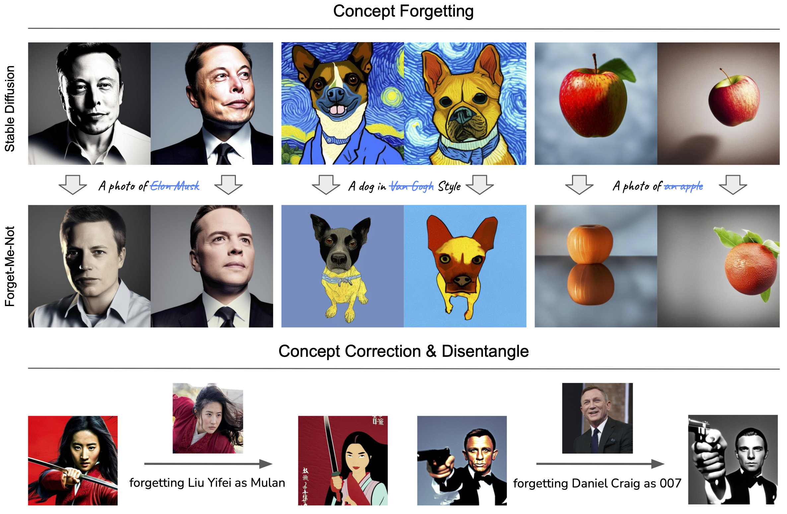
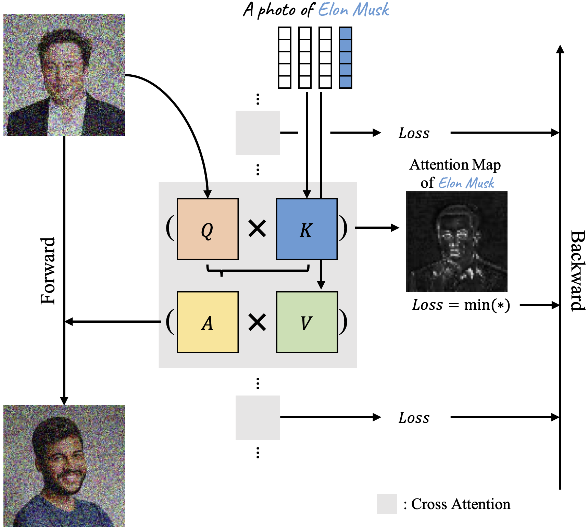

# Forget-Me-Not: Learning to Forget in Text-to-Image Diffusion Models
[Eric Zhang]()<sup>&dagger;</sup>, [Kai Wang](https://wangk.ai/)<sup>&dagger;</sup>, [Xingqian Xu](https://ifp-uiuc.github.io/), [Zhangyang Wang](), [Humphrey Shi](https://www.humphreyshi.com/home)

<sup>&dagger;</sup> Equal Contribution

[[`arXiv`](https://arxiv.org/abs/2303.17591)] [[`pdf`](https://arxiv.org/pdf/2303.17591.pdf)]

This repo contains the code for our paper **Forget-Me-Not: Learning to Forget in Text-to-Image Diffusion Models**.

The significant advances in text-to-image generatve models have prompted global discussions on privacy, copyright, and safety, as numerous unauthorized personal IDs, content, artistic creations, and potentially harmful materials have been learned by these models and later utilized to generate and distribute uncontrolled content. 

To address this challenge, we propose **Forget-Me-Not**, an efficient and low-cost solution designed to safely remove specified IDs, objects, or styles from a well-configured text-to-image model in as little as 30 seconds, without impairing its ability to generate other content. Alongside our method, we introduce the **Memorization Score (M-Score)** and **ConceptBench** to measure the models’ capacity to generate general concepts, grouped into three primary categories: ID, object, and style. Using M-Score and ConceptBench, we demonstrate that Forget-Me-Not can effectively eliminate targeted concepts while maintaining the model’s performance on other concepts. Furthermore, Forget-Me-Not offers two practical extensions: a) removal of potentially harmful or NSFW content, and b) enhancement of model accuracy, inclusion and diversity through concept correction and disentanglement.
It can also be adapted as a lightweight model patch for Stable Diffusion, allowing for concept manipulation and convenient distribution. 

We hope our research and open-source here encourage future research in this critical area and promote the development of safe and inclusive generative models.



#### Features

- Forget-Me-Not is a plug-and-play, efficient and effective concept forgetting and correction method for large-scale text-to-image models.
- It provides an efficient way to forget specific concepts with as few as 35 optimization steps, which typically takes about 30 seconds.
- It can be easily adapted as lightweight patches for Stable Diffusion, allowing for multi-concept manipulation and convenient distribution.
- Novel attention re-steering loss demonstrates that pretrained models can be further finetuned solely with self-supervised signals, i.e. attention scores.



## News

- **[July 17, 2023]**: Code is available!

## Setup

```
conda create -n forget-me-not python=3.8
conda activate forget-me-not

pip install torch==1.13.1+cu116 torchvision==0.14.1+cu116 torchaudio==0.13.1 --extra-index-url https://download.pytorch.org/whl/cu116

pip install -r requirements.txt
```

## Train
We provde an example of forgetting the identity of Elon Musk.
- 

- First, train Ti of a concept. Optional, only needed if `use_ti: true` in `attn.yaml`.
```
python run.py configs/ti.yaml
```
- Second, use attention resteering to forget a concept.
```
python run.py configs/attn.yaml
```
- Results can be found in `exps_ti` and `exps_attn`.

## Empirical Guidance

- Modify `ti.yaml` to tune Ti. In practical, prompt templates, intializer tokens, the number of tokens all have influences on inverted tokens, thus affecting forgetting results.
- Modify `attn.yaml` to tune forgetting procedure. Concept and its type are specified under `multi_concept` as `[elon-musk, object]`. During training, `-` will be replaced with space as the plain text of the concept. A folder containing training images are assumed at `data` folder with the same name `elon-musk`. Set `use_ti` to use inverted tokens or plain text of a concept. Set `only_optimize_ca` to only tune cross attention layers. otherwise UNet will be tuned. Set `use_pooler` to include pooler token `<|endoftext|>` into attention resteering loss.
- To achieve the best results, tune hyperparameters such as `max_train_steps` and `learning_rate`. They can vary concept by concept.
- Use precise attention scores could be helpful, e.g. instead of using all pixels, segment out the pixels of a face, only using their attention scores for forgetting an identity.

## Results


## Citation

If you found Forget-Me-Not useful in your research, please consider starring ⭐ us on GitHub and citing 📚 us in your research!

```bibtex
@article{zhang2023forgetmenot,
      title={Forget-Me-Not: Learning to Forget in Text-to-Image Diffusion Models}, 
      author={Eric Zhang and Kai Wang and Xingqian Xu and Zhangyang Wang and Humphrey Shi},
      journal={arXiv preprint arXiv:2211.08332},
      year={2023}
}
```

## Acknowledgement

We thank the authors of [Diffusers](https://github.com/huggingface/diffusers) and [LoRA](https://github.com/cloneofsimo/lora) for releasing their helpful codebases.
